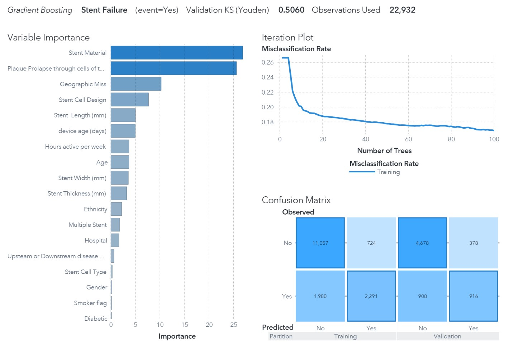

# SAS Visual Analytics - Stent Failures in Cardiac Patients

I took a great class from SAS through my school on their visual analytics platform, and the outcome was this report on predicting stent failures in cardiac patients. The platform lets you quickly create models and then easily compare the results to find the model with the best performance based on the evaluation criteria you choose. The gradient boosting model came out slightly ahead of the others for predicting stent failures. View the full report for details!

